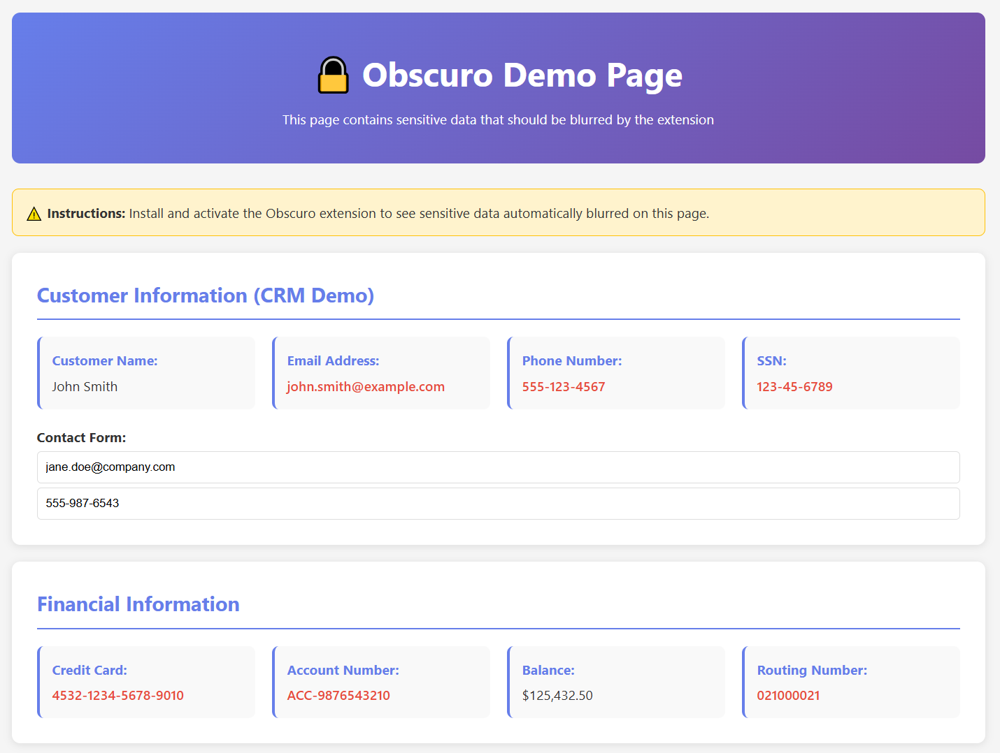
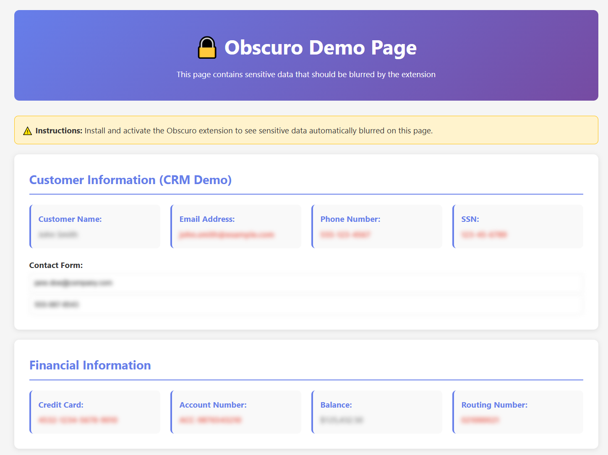
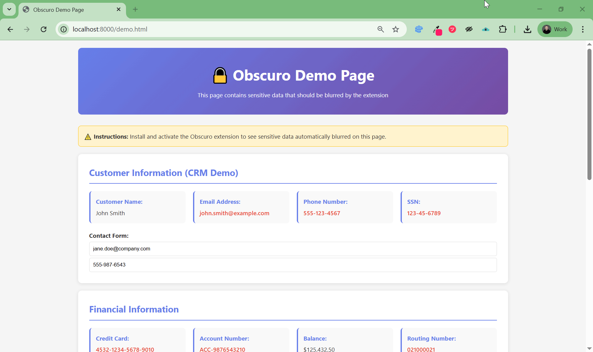

# 🔒 Obscuro - Sensitive Data Hider

[](https://opensource.org/licenses/MIT)
[](https://chrome.google.com/webstore)
[](https://www.typescriptlang.org/)

> **Share your screen without exposing sensitive data.**

Obscuro is a Chrome extension that intelligently hides sensitive information in your browser. Just blur what matters and share your screen with confidence.

---

## ✨ Features

- 🎯 **CSS Selector-based Blurring** - Target specific elements with precision
- 🔍 **Regex Pattern Matching** - Automatically detect and blur sensitive text (emails, SSNs, credit cards, etc.)
- 🚫 **Smart Ignore Rules** - Exclude specific content from blurring
- ⚡ **Dynamic Content Support** - Works with React, Vue, and other SPAs via MutationObserver
- 🎨 **Customizable Blur Effect** - Adjust the blur intensity to your needs by changing the CSS
- 💾 **Import/Export Configs** - Share configurations across teams
- 🔐 **Privacy First** - No data collection, everything runs locally

---

## 📸 Demo

### Before & After

| Before (Sensitive Data Visible) | After (Data Hidden) |
|--------------------------------|---------------------|
|  |  |

### In Action



*Watch Obscuro automatically blur sensitive data in real-time*

---

## 🚀 Quick Start

### Installation

#### From Chrome Web Store (Recommended)
1. Visit the [Chrome Web Store](https://chromewebstore.google.com/detail/obscuro-sensitive-data-hi/peljfjmphjkflheafjlnjmkmdppbcjap)
2. Click "Add to Chrome"
3. Start blurring!

#### Manual Installation (Development)
1. Clone this repository:
   ```bash
   git clone https://github.com/yourusername/obscuro.git
   cd obscuro
   ```

2. Install dependencies:
   ```bash
   npm install
   ```

3. Build the extension:
   ```bash
   npm run build
   ```

4. Load in Chrome:
   - Open `chrome://extensions/`
   - Enable "Developer mode"
   - Click "Load unpacked"
   - Select the `dist/` directory

---

## 📖 Usage

### Basic Configuration

Click the Obscuro icon in your toolbar to open the configuration panel. The extension uses a JSON configuration file:

```json
{
  "version": "1",
  "selectors": [
    "[data-sensitive='true']",
    ".customer-email",
    "input[name='email']"
  ],
  "regex": [
    {
      "pattern": "[A-Z0-9._%+-]+@[A-Z0-9.-]+\\.[A-Z]{2,}",
      "flags": "gi"
    }
  ],
  "ignore": {
    "selectors": [".public-data"],
    "regex": [
      {
        "pattern": "support@mycompany\\.com",
        "flags": "i"
      }
    ]
  }
}
```

### Configuration Options

#### `selectors` (Array of Strings)
CSS selectors to target elements for blurring.

**Examples:**
- `"[data-sensitive='true']"` - Elements with data-sensitive attribute
- `".customer-email"` - Elements with customer-email class
- `"input[name='email']"` - Email input fields
- `"#user-profile .address"` - Specific nested elements

#### `regex` (Array of Objects)
Regular expressions to match and blur text content.

**Structure:**
```json
{
  "pattern": "regex_pattern_here",
  "flags": "gi"  // optional: g=global, i=case-insensitive
}
```

**Common Patterns:**
- Email: `[A-Z0-9._%+-]+@[A-Z0-9.-]+\\.[A-Z]{2,}`
- SSN: `\\b\\d{3}-\\d{2}-\\d{4}\\b`
- Credit Card: `\\b\\d{4}[\\s-]?\\d{4}[\\s-]?\\d{4}[\\s-]?\\d{4}\\b`
- Phone: `\\b\\d{3}[-.\\s]?\\d{3}[-.\\s]?\\d{4}\\b`

#### `ignore` (Object)
Exceptions to prevent blurring of specific content.

**Structure:**
```json
{
  "selectors": ["array of CSS selectors"],
  "regex": [
    {
      "pattern": "pattern_to_ignore",
      "flags": "i"
    }
  ]
}
```

---

## 🎯 Use Cases

### Screen sharing
Hide sensitive data while screen sharing your CRM, analytics platform, or admin dashboard.

### Healthcare
Blur patient names, medical record numbers, and diagnoses during training sessions.

### Financial Services
Mask account numbers, balances, and transaction details in presentations.

### Customer Support
Share screenshots with support teams without exposing sensitive information.

---

## 📦 Example Configurations

We provide pre-built configurations for common use cases:

- **[SaaS/CRM](examples/saas-crm.json)** - Customer emails, phone numbers, addresses
- **[Healthcare](examples/healthcare.json)** - Patient data, medical records, PHI
- **[Financial](examples/financial.json)** - Account numbers, credit cards, balances

To use an example:
1. Open the Obscuro popup
2. Click "Import Config"
3. Select an example JSON file
4. Click "Save Config"

---

## 🛠️ Development

### Prerequisites
- Node.js 16+
- npm or yarn

### Setup
```bash
# Install dependencies
npm install

# Build TypeScript
npm run build
```

### Project Structure
```
obscuro/
├── src/
│   ├── content.ts      # Content script (main logic)
│   ├── popup.ts        # Popup UI logic
│   ├── types.ts        # TypeScript types
│   └── content.css     # Blur styles
├── examples/           # Example configurations
├── icons/              # Extension icons
├── manifest.json       # Chrome extension manifest
├── config.json         # Default configuration
├── popup.html          # Popup UI
└── popup.css           # Popup styles
```

### How It Works

1. **Content Script Injection**: When you visit a page, `content.ts` is injected
2. **Configuration Loading**: The script loads your config from Chrome storage
3. **Initial Scan**: All elements matching your selectors are blurred
4. **MutationObserver**: Watches for DOM changes to blur dynamically added content
5. **Regex Processing**: Text nodes are scanned for regex patterns and wrapped in blur spans
6. **Idempotency**: Uses `data-censor="1"` attribute to prevent re-wrapping

---

## 🔒 Privacy & Security

**Obscuro collects ZERO data.** Everything runs locally in your browser.

- ✅ No analytics or tracking
- ✅ No external API calls
- ✅ No data sent to servers
- ✅ Open source and auditable

---

## 📄 License

This project is licensed under the MIT License - see the [LICENSE](LICENSE) file for details.
